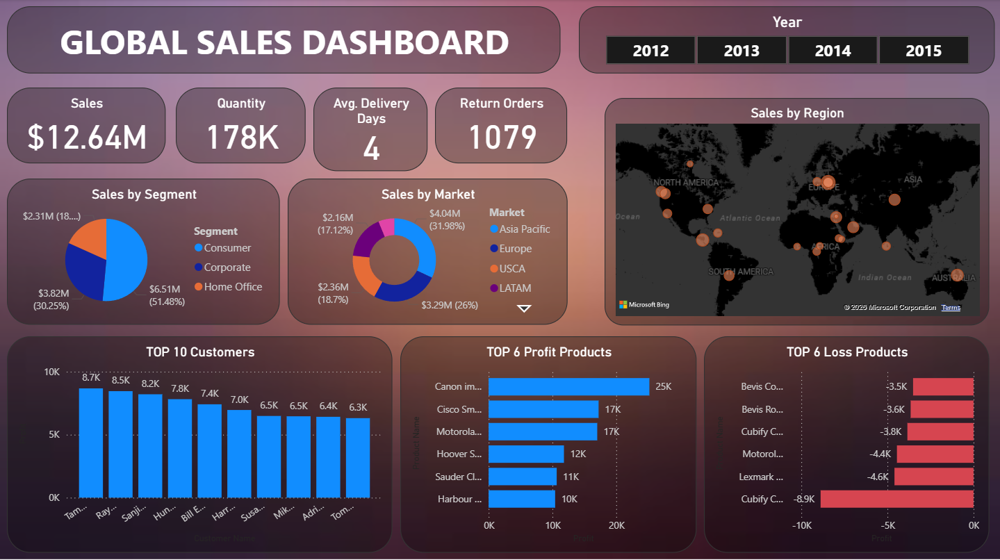

# 📊 Power BI Sales Dashboard

## Project Overview

This Power BI dashboard provides interactive insights into sales performance, customer segments, markets, profitability, and regional trends. It enables business users to monitor key performance indicators and identify high-performing and loss-making products.

---

## Dashboard Preview

---

## Key Metrics

- Total Sales
- Total Quantity Sold
- Average Delivery Days
- Return Orders

---

## Dashboard Features

- Year-wise filtering
- Sales by Region
- Sales by Market
- Sales by Segment
- Top 10 Customers
- Top 6 Profit Products
- Top 6 Loss Products
- Interactive KPI Cards

---

## Tools Used

- Power BI
- Power Query
- DAX
- Excel

---

## Skills Demonstrated

- Data Cleaning
- Data Transformation
- Data Modeling
- DAX Calculations
- Dashboard Design
- Business Intelligence
- Data Visualization

---

## Files Included

- Sales Dashboard.pbix
- dashboard.png
- Dataset

---

## Author

Athulya Suresh
